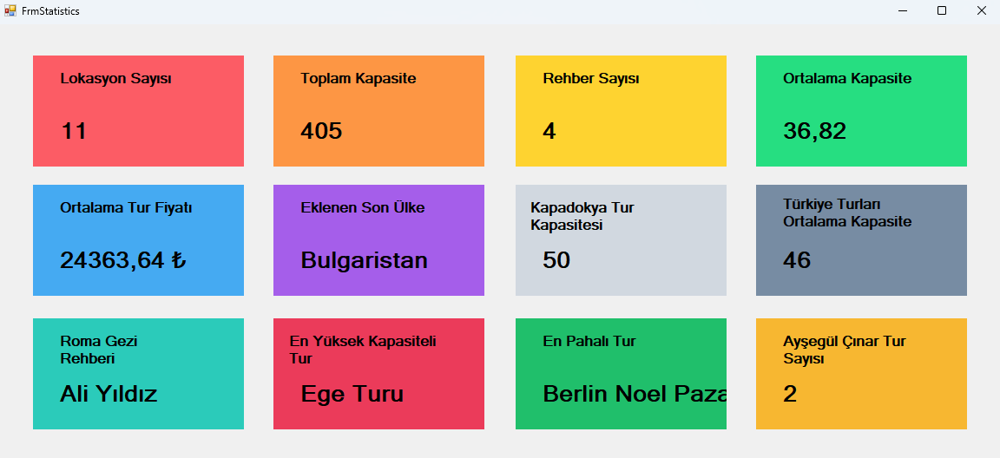

# ✨ Tur Projesi İstatistik Paneli

Bu proje, **Entity Framework** ve **LINQ sorguları** kullanılarak seyahat veri tabanındaki bilgilerin işlenip görselleştirilmesini sağlayan bir istatistik paneli sunmaktadır. **Windows Forms** tabanlı bu uygulama, kullanıcı dostu bir arayüzle çeşitli istatistikleri canlı olarak görüntüler.

## 📋 Özellikler

Projede hesaplanan ve sunulan başlıca istatistikler:
- **Genel Bilgiler**
  - Toplam kapasite
  - Toplam rehber sayısı
  - Ortalama kapasite
  - Ortalama tur fiyatı
- **Son Veriler**
  - Eklenen son ülke
- **Bölgesel Veriler**
  - Kapadokya tur kapasitesi
  - Türkiye turlarının ortalama kapasitesi
- **Rehber ve Turlar**
  - Roma Gezi Rehberi bilgileri
  - Ayşegül Çınar'a bağlı tur sayısı
- **Özel İstatistikler**
  - En yüksek kapasiteli tur
  - En pahalı tur

Tüm bu veriler, **Entity Framework Metotları** ve **LINQ Sorguları** kullanılarak elde edilmiştir.

## 🌟 Kazanımlar

Bu projeyle:
- **Entity Framework** kullanılarak veri tabanına bağlanma, veri işleme ve sorgulama becerileri geliştirildi.
- **LINQ Sorguları** ile verilerin filtrelenmesi ve dönüştürülmesi sağlandı.
- Kullanıcı dostu bir arayüz tasarlanarak istatistikler görselleştirildi.
- Veri analitiği süreçleri pratik edilerek uygulamanın işlevselliği artırıldı.

## 🛠️ Kullanılan Teknolojiler

- **C#**
- **Entity Framework**
- **Windows Forms**
- **LINQ Sorguları**
